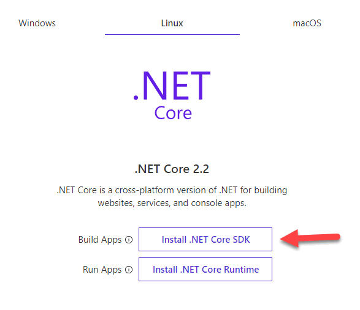
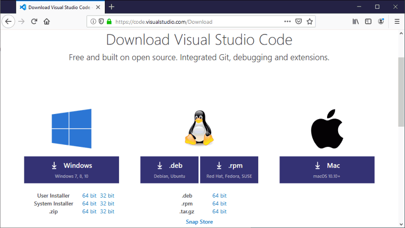

# Ejercicio de Markdown en Github
## pasos para instalar el ambiente de desarrollo para aplicaciones de consola en C#

### Primer paso: Instalacion de .NET CORE 3.0 
1.1- Entramos al siguiente [ENLACE](https://dotnet.microsoft.com/download/dotnet-core/3.0 ) y descargamos la version dependiendo de la arquitectura de tu computadora ya sea 64 bits o 32 bits.  
OJO, tiene que ser el SDK y no solo el runtime, además de verificar bien si lo va a instalar para los sistemas operativos Windows, Linux o mac OS 

 
### Segundo paso: Instalacion de Editor de archivos Visual Studio Code 
Instalación desde la página oficial de Visual Studio Code: [Link](https://code.visualstudio.com/download "Visual Studio Code") 
  
### Tercer Paso: Instalacion de entorno git para cmd
Instalación de Git para un mejor funcionamiento desde el sistema cmd y conexiónes Git: [Link](https://git-scm.com/download/win "Git") 

